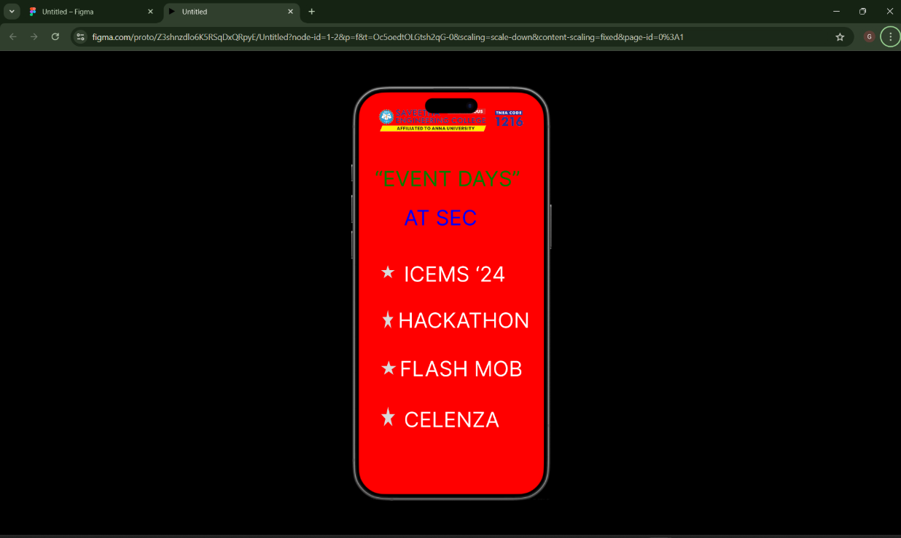

# Ex09 Event Registration Web Application
# Date:25/11/2024
# AIM:
To design, develop and deploy a web application for event registration.

# DESIGN STEPS:
## Step 1:
Create a new frame.

## Step 2:
Select any one preset size of your choice.

## Step 3:
Select the shapes you need.

## Step 4:
Import images as needed.

## Step 5:
Create pages based on your need and link them.

## Step 6:
Validate the HTML and CSS code.

## Step 6:
Publish the website in the given URL.

# DESIGN TOOL:
Figma

# CODE:
```
<div class="container--0-">
  
  <div class="text-0-1-1">“EVENT DAYS”</div>
  <div class="text-0-1-2">AT SEC</div>
  <svg
    width="34"
    height="31"
    viewBox="0 0 34 31"
    fill="none"
    xmlns="http://www.w3.org/2000/svg"
  >
    <path
      d="M17 0L20.8167 11.7467L33.168 11.7467L23.1756 19.0066L26.9923 30.7533L17 23.4934L7.00765 30.7533L10.8244 19.0066L0.832039 11.7467L13.1833 11.7467L17 0Z"
      fill="#D9D9D9"
    ></path></svg
  ><svg
    width="28"
    height="45"
    viewBox="0 0 28 45"
    fill="none"
    xmlns="http://www.w3.org/2000/svg"
  >
    <path
      d="M14 0L17.1432 16.9291L27.3148 16.9291L19.0858 27.3918L22.229 44.3209L14 33.8582L5.77101 44.3209L8.9142 27.3918L0.685208 16.9291L10.8568 16.9291L14 0Z"
      fill="#D9D9D9"
    ></path></svg
  ><svg
    width="38"
    height="34"
    viewBox="0 0 38 34"
    fill="none"
    xmlns="http://www.w3.org/2000/svg"
  >
    <path
      d="M19 0L23.2658 12.7832H37.0701L25.9022 20.6836L30.1679 33.4668L19 25.5664L7.83208 33.4668L12.0978 20.6836L0.929926 12.7832H14.7342L19 0Z"
      fill="#D9D9D9"
    ></path></svg
  ><svg
    width="35"
    height="48"
    viewBox="0 0 35 48"
    fill="none"
    xmlns="http://www.w3.org/2000/svg"
  >
    <path
      d="M17.5 0L21.429 17.9656H34.1435L23.8572 29.0689L27.7862 47.0344L17.5 35.9311L7.21376 47.0344L11.1428 29.0689L0.85651 17.9656H13.571L17.5 0Z"
      fill="#D9D9D9"
    ></path>
  </svg>
  <div class="text-0-1-7">ICEMS ‘24</div>
  <div class="text-0-1-8">HACKATHON</div>
  <div class="text-0-1-9">FLASH MOB</div>
  <div class="text-0-1-10">CELENZA</div>
</div>
<div class="container--0-">
  
  <div class="text-0-1-1">“CELENZA”</div>
  <div class="text-0-1-2">
    cultural events and activities that showcase students talent,<br />innovation
    and competitive spirit
  </div>
  <div class="text-0-1-3">DATE:10/01/2025</div>
  <div class="text-0-1-4">COME AND PARTICIPATE AND ENJOY THE EVENTS</div>
</div>


PAGE 2:


<div class="container--0-">
  
  <div class="text-0-1-1">“EVENT DAYS”</div>
  <div class="text-0-1-2">AT SEC</div>
  <svg
    width="34"
    height="31"
    viewBox="0 0 34 31"
    fill="none"
    xmlns="http://www.w3.org/2000/svg"
  >
    <path
      d="M17 0L20.8167 11.7467L33.168 11.7467L23.1756 19.0066L26.9923 30.7533L17 23.4934L7.00765 30.7533L10.8244 19.0066L0.832039 11.7467L13.1833 11.7467L17 0Z"
      fill="#D9D9D9"
    ></path></svg
  ><svg
    width="28"
    height="45"
    viewBox="0 0 28 45"
    fill="none"
    xmlns="http://www.w3.org/2000/svg"
  >
    <path
      d="M14 0L17.1432 16.9291L27.3148 16.9291L19.0858 27.3918L22.229 44.3209L14 33.8582L5.77101 44.3209L8.9142 27.3918L0.685208 16.9291L10.8568 16.9291L14 0Z"
      fill="#D9D9D9"
    ></path></svg
  ><svg
    width="38"
    height="34"
    viewBox="0 0 38 34"
    fill="none"
    xmlns="http://www.w3.org/2000/svg"
  >
    <path
      d="M19 0L23.2658 12.7832H37.0701L25.9022 20.6836L30.1679 33.4668L19 25.5664L7.83208 33.4668L12.0978 20.6836L0.929926 12.7832H14.7342L19 0Z"
      fill="#D9D9D9"
    ></path></svg
  ><svg
    width="35"
    height="48"
    viewBox="0 0 35 48"
    fill="none"
    xmlns="http://www.w3.org/2000/svg"
  >
    <path
      d="M17.5 0L21.429 17.9656H34.1435L23.8572 29.0689L27.7862 47.0344L17.5 35.9311L7.21376 47.0344L11.1428 29.0689L0.85651 17.9656H13.571L17.5 0Z"
      fill="#D9D9D9"
    ></path>
  </svg>
  <div class="text-0-1-7">ICEMS ‘24</div>
  <div class="text-0-1-8">HACKATHON</div>
  <div class="text-0-1-9">FLASH MOB</div>
  <div class="text-0-1-10">CELENZA</div>
</div>

PAGE 3:


<div class="container--0-">
  
  <div class="text-0-1-1">“ICEMS ‘24”</div>
  <div class="text-0-1-2">
    INTERNATIONAL CONFERENCE ON THE EDUCATION POST MILLENNIALS
  </div>
  <div class="text-0-1-3">DATE:01/01/2025</div>
  <div class="text-0-1-4">PRIZE:10,000/-</div>
  <svg
    width="192"
    height="52"
    viewBox="0 0 192 52"
    fill="none"
    xmlns="http://www.w3.org/2000/svg"
  >
    <rect width="192" height="52" fill="#D9D9D9"></rect>
  </svg>
  <div class="text-0-1-6">REGISTER</div>
  <div class="text-0-1-7">Participate and win the cash prize</div>
</div>

PAGE  4:

<div class="container--0-">
  
  <div class="text-0-1-1">‘HACKATHON’</div>
  <div class="text-0-1-2">
    The word “hackathon”<br />is a combination of the words “hack” and
    “marathon”
  </div>
  <div class="text-0-1-3">DATE:03/01/2025</div>
  <div class="text-0-1-4">PRIZE:1,00,000/-</div>
  <div class="text-0-1-5">REGISTER</div>
  <div class="text-0-1-6">Participate and win the cash money</div>
</div>


PAGE 4:

<div class="container--0-">
  
  <div class="text-0-1-1">“FLASH MOB”</div>
  <div class="text-0-1-2">
    A celebration of joy,energy, and rhythm,where students dance to the beats of
    a live DJ
  </div>
  <div class="text-0-1-3">DATE:05/01/2025</div>
  <div class="text-0-1-4">PRIZE:50,000/-</div>
  <svg
    width="267"
    height="63"
    viewBox="0 0 267 63"
    fill="none"
    xmlns="http://www.w3.org/2000/svg"
  >
    <rect width="267" height="63" fill="#D9D9D9"></rect>
  </svg>
  <div class="text-0-1-6">REGISTER</div>
  <div class="text-0-1-7">Participate and win the prize money</div>
</div>


PAGE 5:

<div class="container--0-">
  
  <div class="text-0-1-1">“CELENZA”</div>
  <div class="text-0-1-2">
    cultural events and activities that showcase students talent,<br />innovation
    and competitive spirit
  </div>
  <div class="text-0-1-3">DATE:10/01/2025</div>
  <div class="text-0-1-4">COME AND PARTICIPATE AND ENJOY THE EVENTS</div>
</div>
```
# OUTPUT:




# RESULT:

The program to design, develop and deploy a web application for event registration is completed successfully.
